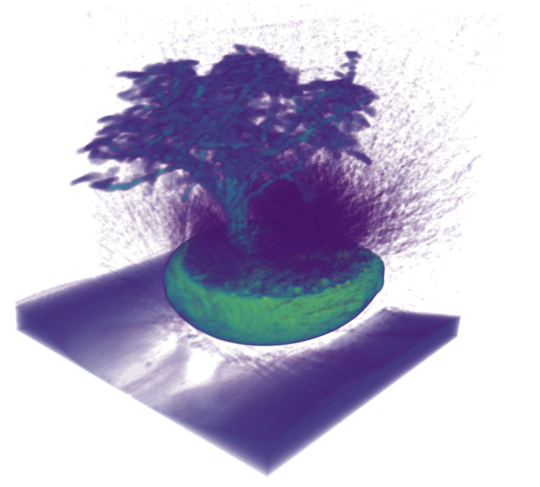

# volren

**Vol**ume **Ren**dering is a [BabylonJS](https://www.babylonjs.com/) implementation of  [Will Usher article](https://www.willusher.io/webgl/2019/01/13/volume-rendering-with-webgl) about volume rendering.

This project is mainly used to discover BabylonJS and volume rendering.

## Controls
* MB1 (viewer): rotate
* MB1 (colormap): change color

## Tools
* [BabylonJS](https://www.babylonjs.com/) 5
* [Vite](https://vitejs.dev/) 4

## Resources
* [Bonsai](https://klacansky.com/open-scivis-datasets/)
* [ColorMaps](https://observablehq.com/@flimsyhat/webgl-color-maps)